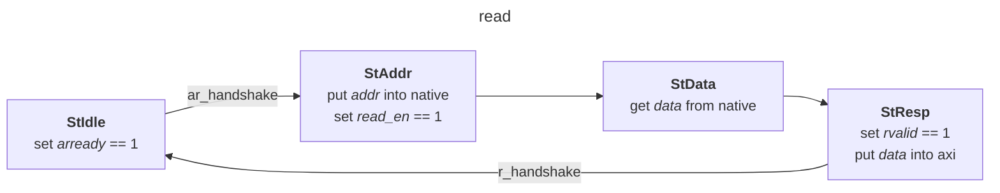
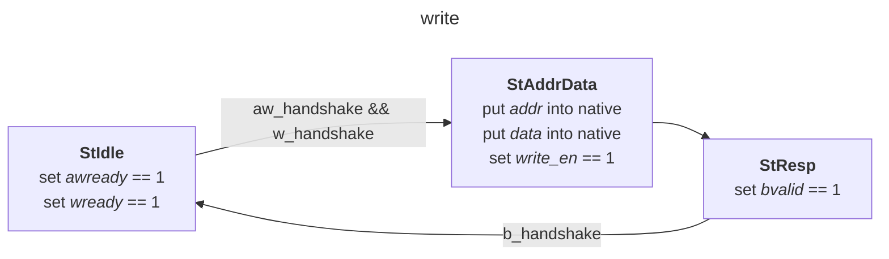

```mermaid
---
title: read
---

graph LR
  StIdle -->|ar_handshake| StAddr
  StAddr --> StData
  StData --> StResp
  StResp -->|r_handshake| StIdle

  StIdle["`**StIdle**
      set *arready* == 1`"]
  StAddr["`**StAddr**
      put *addr* into native
      set *read_en* == 1`"]
  StData["`**StData**
      get *data* from native`"]
  StResp["`**StResp**
      set *rvalid* == 1
      put *data* into axi`"]
```

```mermaid
---
title: write
---

graph LR
  StIdle -->|aw_handshake && w_handshake| StAddrData
  StAddrData --> StResp
  StResp -->|b_handshake| StIdle

  StIdle["`**StIdle**
      set *awready* == 1
      set *wready*  == 1`"]
  StAddrData["`**StAddrData**
      put *addr* into native
      put *data* into native
      set *write_en* == 1`"]
  StResp["`**StResp**
      set *bvalid* == 1`"]
```
